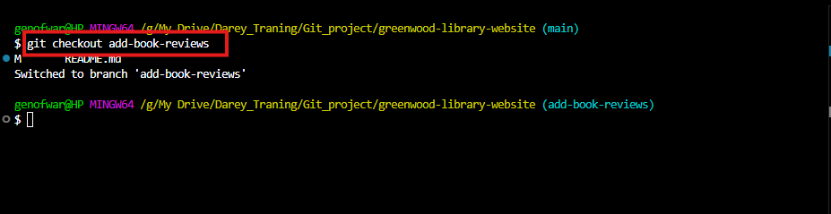
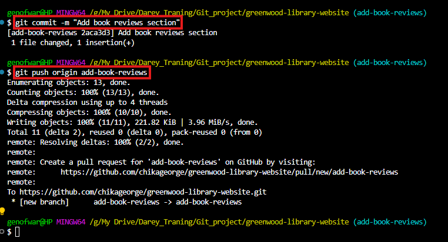
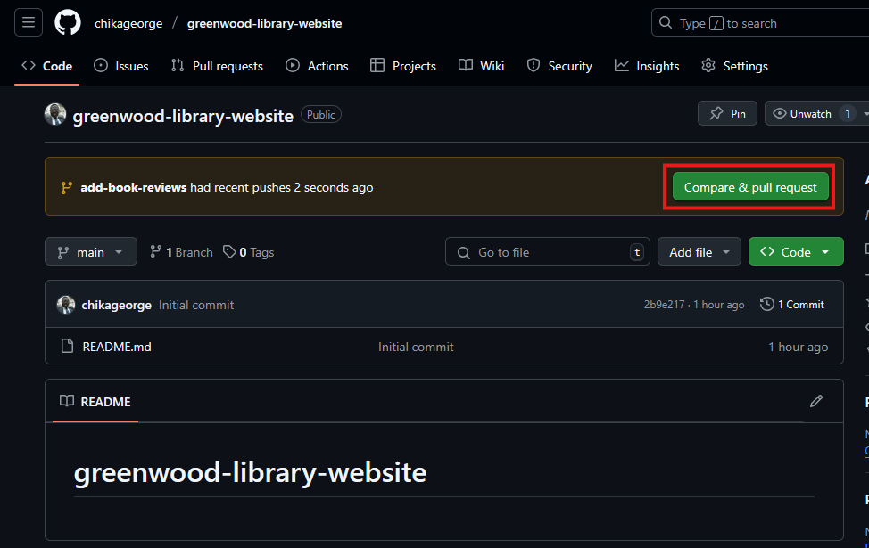
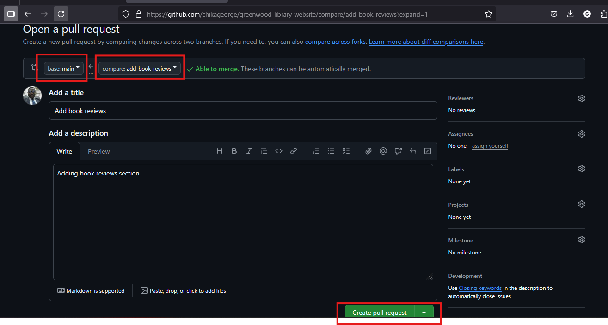
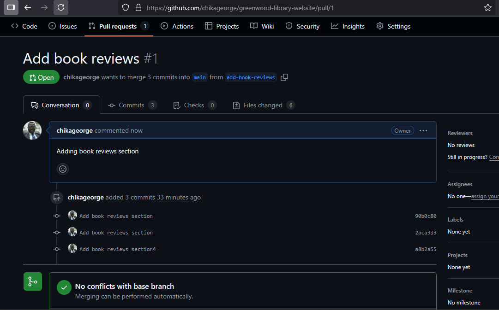
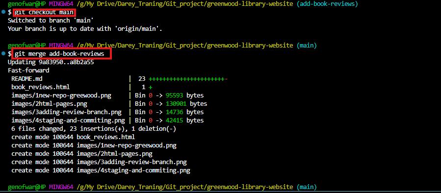
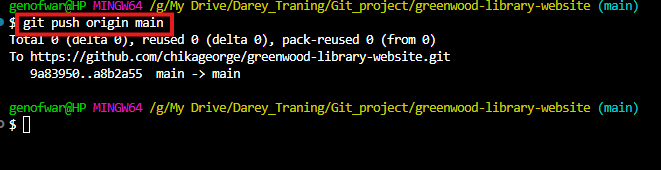

# Collaborative Git Workflow

## Morgan's Work: Adding Book Reviews Section

### 1. Create and Switch to New Branch
```bash
git checkout main
git pull origin main         
git checkout -b add-book-reviews
```


### 2. Stage and Commit changes
```bash
git add book_reviews.html
git commit -m "Add book reviews section"
git push origin add-book-reviews
```


### 3. Creating Pull Request for Morgan's Work
#### Steps:
**Navigate to repository on GitHub**

**Click "Compare & pull request" for add-book-reviews**

**Add description: "Adding book reviews section"**

**Click "Create pull request"**




### 4. Merging to Main (After Approval)
```bash
git checkout main
git merge morgan-book-reviews
git push origin main
```

